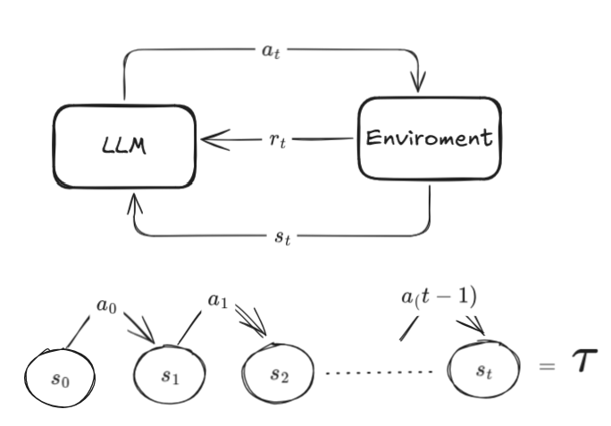
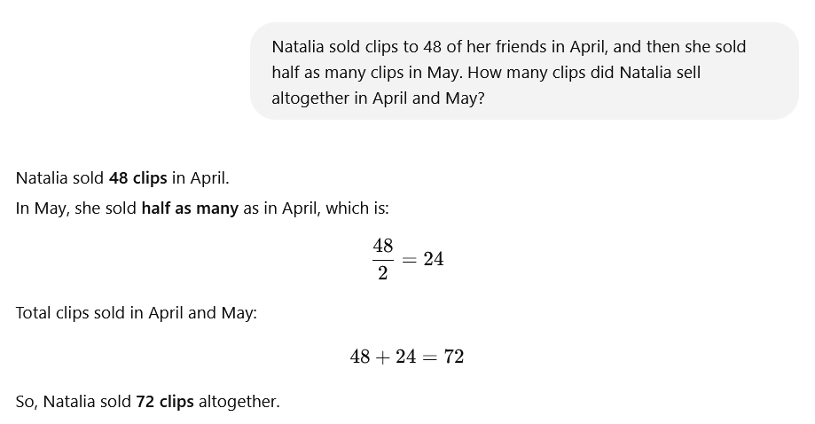
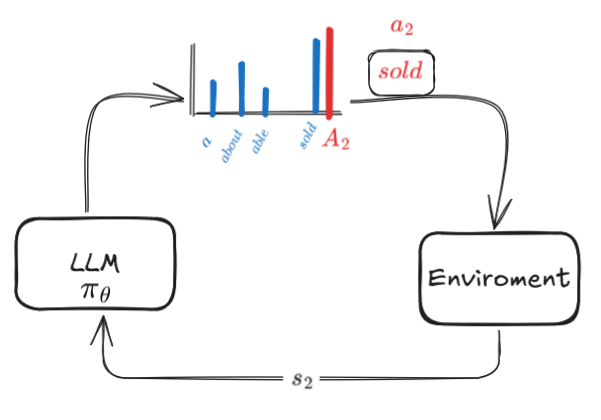

# Proximal Policy Optimization (PPO) for LLMs: A Comprehensive Tutorial

## Introduction
Proximal Policy Optimization (PPO) is a reinforcement learning algorithm that has become fundamental in aligning Large Language Models (LLMs) with human preferences. It's the backbone of reasoning models like OpenAI's o1 models, Claude 3.7, and others. While the original OpenAI paper contains dense mathematical formulations, this tutorial aims to break down PPO from first principles, making it accessible even to those without extensive reinforcement learning backgrounds.

## Table of Contents
1. [Reinforcement Learning Fundamentals for LLMs](#reinforcement-learning-fundamentals-for-llms)
2. [Understanding Policy Gradient Methods](#understanding-policy-gradient-methods)
3. [The Value Function and Actor-Critic Architecture](#the-value-function-and-actor-critic-architecture)
4. [Generalized Advantage Estimation (GAE)](#generalized-advantage-estimation-gae)
5. [The PPO Algorithm: End-to-End Training](#the-ppo-algorithm-end-to-end-training)
6. [Importance Sampling in PPO](#importance-sampling-in-ppo)
7. [PPO Clipping: The Key Innovation](#ppo-clipping-the-key-innovation)

## Reinforcement Learning Fundamentals for LLMs

### The RL Framework: Agents, Environments, and Rewards
In traditional reinforcement learning, we have:
- **Agent**: In our case, this is the LLM (like Llama)
- **Environment**: The external world, including humans, tools, and data
- **States**: The current context of interaction
- **Actions**: Token predictions made by the LLM
- **Rewards**: Feedback signals (often delayed until completion)

### LLM-Specific RL Concepts
Unlike physical agents like robots, LLMs work with:
- **States (S)**: The accumulated prompt + previously generated tokens
- **Actions (A)**: Predicting the next token from the vocabulary
- **Trajectories (τ)**: Complete sequences of states and actions (full generations)
- **Rewards (R)**: Often sparse (only at completion) based on quality metrics

### Example: Math Reasoning Task
Let's consider the GSM8K dataset example:
- **Initial State (S₀)**: The math problem prompt
- **Actions**: Generating tokens like "Natalie sold..." 
- **Final Reward**: 1 if the answer is correct (e.g., "72"), 0 otherwise
  

This sparse reward signal makes training particularly challenging, as we must propagate this single value through billions of parameters.
Consider a training scenario with a model like Llama:

1. We input a math problem as a prompt
2. The model generates a response
3. We check if the final answer (e.g., "72") matches the reference answer

The model might generate a response beginning with "To find out..." and eventually concluding with the answer "72".

Let's break down how this maps to our reinforcement learning framework:

1. **Initial State (S₀)**: The math problem prompt
2. **First Action (a₀)**: The model predicts the token "To"
3. **State Update**: Environment updates to State S₁ = [prompt + "To"]
4. **Second Action (a₁)**: Model predicts the token "find"
5. **State Update**: Environment updates to State S₂ = [prompt + "To find"]
6. **Third Action (a₂)**: Model predicts the token "out"
7. **State Update**: Environment updates to State S₃ = [prompt + "To find out"]

This process continues token by token until the model generates an end token, concluding the episode.

### The Sparse Reward Challenge

The critical challenge in this setup is that we can only evaluate the quality of the response at the very end:

- **Reward Assignment**: When the model finishes generating the complete answer, we extract the final numerical answer ("72")
- **Reward Calculation**: If it matches the reference answer, we assign a positive reward (e.g., reward = 1)
- **Intermediate Rewards**: All other steps in the generation process receive zero reward

This creates what's known as a **sparse reward** problem. Some implementations might use more sophisticated reward schemes:

- DeepSeek scores responses on both correctness and formatting
- Some projects use external reward models to provide intermediate rewards (e.g., after each sentence)

### The Credit Assignment Problem

The fundamental challenge can now be clearly seen: with only a single numeric reward at the end of a potentially long sequence of actions, how do we:

1. Determine which specific actions (tokens) contributed positively?
2. Correctly update billions of model parameters?
3. Avoid overemphasizing the final tokens just because they're temporally closer to the reward?

This is extremely difficult even at an intuitive level. We're trying to use a single value to update billions of parameters across a long sequence of decisions. The brittleness of this approach is why reinforcement learning for LLMs is so challenging.

Making this training process robust is considered the "Holy Grail" of reinforcement learning. Algorithms like PPO incorporate decades of research and numerous tricks to make this process work in practice.

## Understanding Policy Gradient Methods

### The Policy Concept
In RL terminology, the LLM is referred to as a **policy** ($\pi_\theta$), where $\theta$ represents the model parameters. This is a crucial concept to understand:

- The policy $\pi_\theta$ is simply another name for our language model—it's the same neural network with billions of parameters that we've been discussing.
- The subscript $\theta$ explicitly reminds us that the model has parameters that we can adjust during training.

When we use a language model to generate text, what's actually happening is:

1. We input a state $s_t$ (the prompt plus previously generated tokens)
2. The model (policy) processes this input through its layers
3. The final layer outputs a probability distribution over the entire vocabulary
4. This distribution $\pi_\theta(·|s_t)$ tells us the probability of each possible next token

For example, if we're at a state where the model has already generated "To find", the policy $\pi_\theta(·|s_t)$ might assign:
- 0.7 probability to "out"
- 0.1 probability to "the"
- 0.05 probability to "a"
- And smaller probabilities to thousands of other tokens

We then sample from this distribution to select the next token (or use techniques like greedy sampling or beam search).

### Supervised vs Reinforcement Learning Approaches

#### In Supervised Learning:
When training language models with supervised learning, we:
1. Have a reference "correct" token for each position
2. Create a target distribution where this correct token has probability 1.0 and all others have 0.0
3. Measure the divergence (typically cross-entropy) between:
   - The model's predicted distribution $\pi_\theta(·|s_t)$
   - This target "one-hot" distribution
4. Update model parameters to make the predicted distribution closer to the target

After each update, the probability of the correct token increases slightly while all others decrease.

#### In Reinforcement Learning (Policy Gradient):
With RL, we don't have reference "correct" tokens. Instead:
1. We sample actions (tokens) from the model's predicted distribution
2. We evaluate the quality of the resulting trajectory using a reward function
3. We want to adjust the model to make good actions (those leading to high rewards) more likely

The challenge becomes: **How do we know which specific actions contributed to the final reward?** This is the credit assignment problem.

Policy gradient methods solve this by:
1. Defining an **advantage** $A_t$ for each action
2. Using this advantage as a scaling factor for updates
3. Making actions with positive advantage more likely, and actions with negative advantage less likely

### Policy Gradient Loss

$a_2 \sim \pi_\theta(s_2)$

$\mathbb{P}(a_2) = \pi_\theta(a_2|s_2) \cdot A_2$

$\text{Update } \nabla_\theta\pi_\theta(a_2|s_t) \cdot A_2$

$\text{Loss } \pi_\theta(a_2|s_2) \cdot A_2$

$\text{Loss } \sum_{t=0}^{T} \pi_\theta(a_t|s_t) \cdot A_t$

$\text{Loss } \sum_{t=0}^{T} \log \pi_\theta(a_t|s_t) \cdot A_t$

The fundamental principle of policy gradient methods is to optimize model parameters to increase the probability of actions that lead to higher rewards. The policy gradient loss function is formulated as:

$L_{PG} = -\log(\pi_\theta(a_t|s_t)) \cdot A_t$

Where:
- $\pi_\theta(a_t|s_t)$ represents the probability of selecting action $a_t$ in state $s_t$ under policy $\pi_\theta$
- $A_t$ denotes the advantage of that action
- The negative sign converts this into a minimization problem for gradient descent optimization

This formulation creates an effect analogous to supervised learning:
- For $A_t > 0$ (actions better than average), the probability of that action increases
- For $A_t < 0$ (actions worse than average), the probability decreases
- The magnitude of $A_t$ determines the scale of probability adjustment

The key insight is that by utilizing the advantage as a scaling factor, we can train models without requiring explicit "correct" tokens—we simply need to determine how good each action was relative to average performance.

To implement policy gradient methods effectively, we take steps in the direction of the gradient of this expression. Through mathematical derivation, we can determine that the loss function that produces this gradient is the probability of the action multiplied by the advantage. For complete trajectories, we aggregate this loss across all time steps.

The logarithmic form of the probability in the loss function provides mathematical convenience. This formulation maintains the desired directional updates while offering better numerical properties and theoretical connections to information theory. This approach differs fundamentally from supervised fine-tuning, where loss functions typically measure the distance between model predictions and ground truth labels.

Having established the loss function, we must address a critical question: how do we calculate the advantage term $A_t$? Various reinforcement learning algorithms employ different methods. Two notable approaches are Proximal Policy Optimization (PPO) from OpenAI and Grouped Reference Policy Optimization (GRPO) from DeepSeek.

This tutorial focuses on PPO, which employs the following principle: since we lack knowledge of the "correct" action (unlike in supervised learning), we compare each action against the average expected outcome. PPO defines advantage by answering the question: "How much better than average was the action we selected?" or "How much improvement did we achieve compared to a baseline policy?"

While the policy gradient loss provides a theoretical framework for updating our model, we require a mechanism to calculate the advantage term $A_t$. This is where the **Value Function** becomes essential, providing a critical component for estimating the quality of each state and enabling us to determine the relative advantage of our actions.

## The Value Function and Actor-Critic Architecture

### State Value Function
The **value function** ($V_\phi$) estimates how good a given state is. It:
- Has its own separate parameters $\phi$
- Predicts the expected future rewards from a given state
- Helps compute the advantage of actions

For example:
- A nonsensical state like "beep boop bop" would have low value
- A promising start like "To find out" would have medium value
- A correct solution like "Answer is 72" would have high value

### Actor-Critic Models
PPO uses an actor-critic architecture:
- The **actor** is the policy (LLM) that takes actions
- The **critic** is the value function that evaluates states
- Both components are trained simultaneously but with different objectives

### Value Function Loss
The value function is trained to predict the discounted sum of future rewards:

$V(s_t) = E_{\tau \sim \pi} [r_t + r_{t+1} + ... + r_T | s_t]$

$V(s_t) = E_{\tau \sim \pi} [r_t + γr_{t+1} + ... + γ^{(T-t)}r_T | s_t]$

$V(s_t) = E_{\tau \sim \pi} [G_t | s_t]$   \quad (G_{t} = \text{total discounted return})$

$L_{t}^{VF} = \left(V_{\phi}(s_{t}) - G_{t}\right)^2$

$$L_{VF} = (V_\phi(s_t) - G_t)^2$$

Where $G_t$ is the discounted return (actual sum of future rewards).

## Generalized Advantage Estimation (GAE)

### The Advantage Dilemma
The advantage function tries to answer: "How much better was this action than average?"

Mathematically:

$$A(s_t, a_t) = Q(s_t, a_t) - V(s_t)$$

Where:
- $Q(s_t, a_t)$ is the expected return of taking action $a_t$ in state $s_t$
- $V(s_t)$ is the expected return from state $s_t$ (regardless of action)

### Computing the Advantage
Two extreme approaches to calculate the advantage:
1. **Monte Carlo**: Wait for the episode to complete and use actual returns (high variance, low bias)
2. **Bootstrapping**: Use the value function estimate of the next state (low variance, high bias)

The bootstrapped advantage estimate is:

$$\delta_t = r_t + \gamma V(s_{t+1}) - V(s_t)$$

### Generalized Advantage Estimation
PPO uses GAE to balance bias and variance:

$$A^{GAE}_t = \sum_{i=0}^{\infty} (\gamma \lambda)^i \delta_{t+i}$$

Where:
- $\lambda$ controls the bias-variance tradeoff (0 ≤ λ ≤ 1)
- $\gamma$ is the discount factor
- $\delta_t$ is the temporal difference residual

This creates a weighted combination of advantage estimates at different time scales.

## The PPO Algorithm: End-to-End Training

### Basic Training Loop
1. Initialize policy parameters $\theta$ (usually from a pre-trained LLM)
2. Initialize value function parameters $\phi$
3. For each training iteration:
   - Collect trajectories (LLM completions) using current policy
   - Compute returns and advantages for each state-action pair
   - Update both policy and value function parameters using their respective losses

### Multi-Epoch Training Challenge
PPO improves efficiency by reusing the same batch of trajectories for multiple updates. However, this introduces a distribution mismatch:
- Trajectories were sampled using the old policy ($\theta_{old}$)
- Updates are computed using the current policy ($\theta$)

## Importance Sampling in PPO

### The Distribution Shift Problem
To address the distribution mismatch in multi-epoch training, PPO uses importance sampling:
- Introduces a ratio between the new and old policy probabilities
- Adjusts the loss proportionally to this ratio

The importance sampling ratio is:

$$r_t(\theta) = \frac{\pi_\theta(a_t|s_t)}{\pi_{\theta_{old}}(a_t|s_t)}$$

This ratio measures how much the probability of an action has changed after parameter updates.

### Surrogate Loss
PPO replaces the log-probability in the original policy gradient with the importance sampling ratio:

$$L_{CLIP\_surrogate} = r_t(\theta) \cdot A_t$$

This allows multiple training epochs on the same data while maintaining mathematical correctness.

## PPO Clipping: The Key Innovation

### The Clipping Mechanism
PPO's main innovation is constraining policy updates to prevent instability. It clips the importance sampling ratio:

$$L_{CLIP} = \min(r_t(\theta) \cdot A_t, \text{clip}(r_t(\theta), 1-\epsilon, 1+\epsilon) \cdot A_t)$$

Where:
- $\epsilon$ is a hyperparameter (typically 0.1 or 0.2)
- $\text{clip}(r_t(\theta), 1-\epsilon, 1+\epsilon)$ restricts the ratio to the range $[1-\epsilon, 1+\epsilon]$

This clipping mechanism:
- Prevents excessively large policy updates
- Stabilizes training by keeping new policy close to old policy
- Acts as a simpler alternative to trust region methods

### The Complete PPO Loss
The final PPO objective combines the clipped surrogate loss with the value function loss:

$$L_{PPO} = L_{CLIP} - c_1 \cdot L_{VF} + c_2 \cdot S[\pi_\theta]$$

Where:
- $c_1$ and $c_2$ are coefficients
- $S[\pi_\theta]$ is an optional entropy bonus term to encourage exploration
